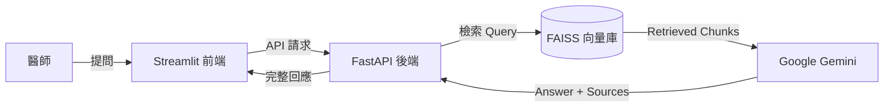

# 🩺 Medi-Insight: RAG-Based Medical Assistant

  

**Medi-Insight** 是一個專為精準醫療設計的智慧病歷問答系統。它利用 **RAG (Retrieval-Augmented Generation)** 技術，解決了大型語言模型在醫療領域常見的「幻覺 (Hallucination)」問題，實現了**「有憑有據」**的臨床輔助決策。

## 🚀 Key Features (核心功能)

* **Evidence-Based QA (實證問答):** 系統不僅回答問題，還會附上具體的 **參考來源 (Source & Page Number)**，確保醫生可以核實資訊。
* **Anti-Hallucination (抗幻覺機制):** 針對病歷中不存在的突變 (如 L858R)，系統會拒絕回答並主動糾正 (如指出是 Exon 19 Deletion)。
* **Privacy First (隱私優先):** 使用本地向量資料庫 (FAISS) 與 HuggingFace Embeddings，敏感的向量資料無需上傳至第三方雲端。
* **Containerized (容器化部署):** 完整封裝於 Docker，解決了 Python 複雜的依賴衝突問題 (Dependency Hell)。

## 🛠️ Tech Stack (技術堆疊)

* **LLM:** Google Gemini 2.0 Flash (via `langchain-google-genai`)
* **Embedding Model:** HuggingFace `all-MiniLM-L6-v2` (Local Execution)
* **Vector DB:** FAISS (CPU Optimized)
* **Framework:** LangChain (RAG Chain Construction)
* **Backend:** FastAPI + Uvicorn (Asynchronous API)
* **Frontend:** Streamlit
* **DevOps:** Docker (Slim-based Image)

## 🏗️ Architecture (系統架構)



## 💻 Installation

```bash
# 1. 建置 Docker 映像檔
docker build -t medi-final .

# 2. 啟動服務 (同時開啟 API 與 前端)
docker run --name medi-demo -d -p 8000:8000 -p 8501:8501 -v ${PWD}:/app medi-final

# 3. 進入容器啟動服務
docker exec -d medi-demo uvicorn main:app --host 0.0.0.0 --port 8000
docker exec -it medi-demo streamlit run app.py
```