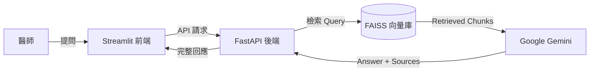

# 🩺 Medi-Insight: RAG-Based Medical Assistant

[](https://github.com/vincent890203-code/medi-insight-rag/actions/workflows/docker-build.yml)


**Medi-Insight** 是一個專為精準醫療設計的智慧病歷問答系統。它利用 **RAG (Retrieval-Augmented Generation)** 技術，解決了大型語言模型在醫療領域常見的「幻覺 (Hallucination)」問題，實現了**「有憑有據」**的臨床輔助決策。

## Project Structure
```bash
medi-insight-rag/
├── 📂 app/                      # 核心應用程式邏輯
│   ├── 📂 core/
│   │   ├── ingest.py            # [ETL] PDF 解析與向量化流程 (Document Loader)
│   │   └── rag.py               # [Logic] RAG 檢索增強生成核心 (Chain Definition)
│   └── __init__.py
│
├── 📂 data/                     # 原始資料庫 (Knowledge Base)
│   └── patient_report_*.pdf     # 去識別化的模擬病歷 PDF
│
├── 📂 faiss_index/              # 向量資料庫 (Vector DB)
│   ├── index.faiss              # FAISS 索引檔 (儲存向量)
│   └── index.pkl                # Metadata 序列化檔案
│
├── 📂 tests/                    # 測試與驗證工具 (Dev Tools)
│   ├── check_models.py          # 模型連線檢查腳本 (Model Health Check)
│   ├── debug_langchain.py       # LangChain 流程除錯工具
│   └── create_pdf.py            # 合成資料生成器 (Synthetic Data Gen)
│
├── 📜 main.py                   # [Backend] FastAPI 應用程式入口點
├── 📜 web_ui.py                 # [Frontend] Streamlit 使用者介面
├── 🐳 Dockerfile                # 容器化建置設定檔
├── 📜 requirements.txt          # Python 依賴套件清單 (Pinned Versions)
├── 📜 start.sh                  # 服務啟動腳本 (Orchestrator)
└── ⚙️ .env                       # 環境變數與 API Keys (GitIgnored)
```

## 🚀 Key Features (核心功能)

* **Evidence-Based QA (實證問答):** 系統不僅回答問題，還會附上具體的 **參考來源 (Source & Page Number)**，確保醫生可以核實資訊。
* **Anti-Hallucination (抗幻覺機制):** 針對病歷中不存在的突變 (如 L858R)，系統會拒絕回答並主動糾正 (如指出是 Exon 19 Deletion)。
* **Privacy First (隱私優先):** 使用本地向量資料庫 (FAISS) 與 HuggingFace Embeddings，敏感的向量資料無需上傳至第三方雲端。
* **Containerized (容器化部署):** 完整封裝於 Docker，解決了 Python 複雜的依賴衝突問題 (Dependency Hell)。

## 🛠️ Tech Stack (技術堆疊)

* **LLM:** Google Gemini 2.0 Flash (via `langchain-google-genai`)
* **Embedding Model:** HuggingFace `all-MiniLM-L6-v2` (Local Execution)
* **Vector DB:** FAISS (CPU Optimized)
* **Framework:** LangChain (RAG Chain Construction)
* **Backend:** FastAPI + Uvicorn (Asynchronous API)
* **Frontend:** Streamlit
* **DevOps:** Docker (Slim-based Image)

## 🏗️ Architecture (系統架構)



## 🚀 Quick Start (快速啟動)

### Prerequisites
* Docker & Docker Compose installed
* Google API Key (configured in `.env`)

### 1. Clone & Setup
```bash
git clone [https://github.com/vincent890203-code/medi-insight-rag.git](https://github.com/vincent890203-code/medi-insight-rag.git)
cd medi-insight-rag
```

## Configure Environment
建立 .env 檔案並填入金鑰：
```bash
echo "GOOGLE_API_KEY=your_api_key_here" > .env
```

## Run with Docker
直接使用 Docker Compose 一鍵啟動後端 API 與前端介面：
```bash
docker build -t medi-insight-rag .
docker run -p 8000:8000 -p 8501:8501 --env-file .env medi-insight-rag
```
啟動後請訪問：

Web UI: http://localhost:8501

API Docs: http://localhost:8000/docs

